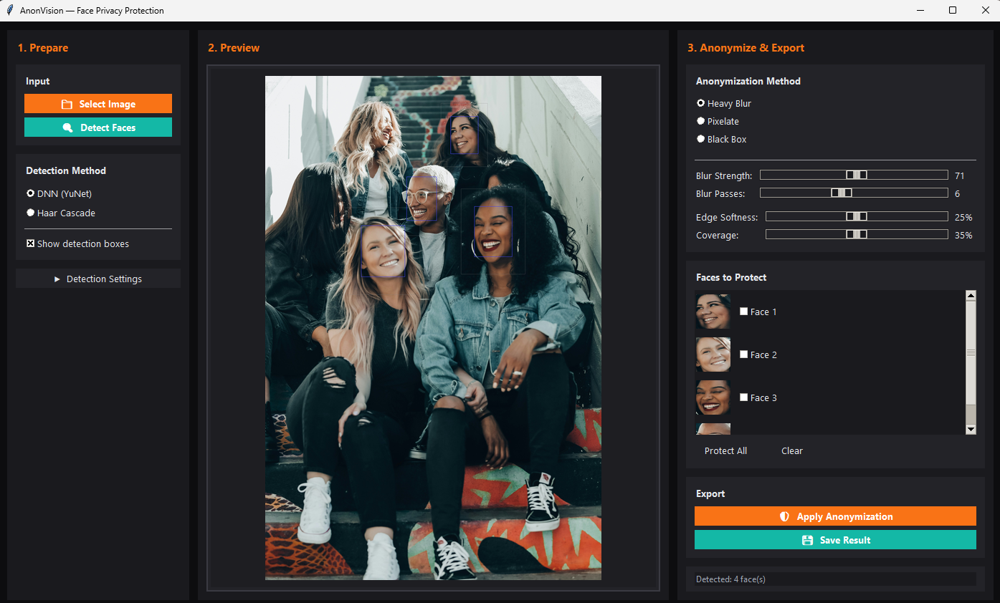

# 📘 AnonVision User Guide

## Face Privacy Protection Application

**Version:** 1.0  
**Last Updated:** December 2025

---

## Table of Contents

1. [Introduction](#1-introduction)
2. [System Requirements](#2-system-requirements)
3. [Installation](#3-installation)
4. [Application Workflow](#4-application-workflow)
   - [Panel 1: Prepare](#panel-1-prepare-left)
   - [Panel 2: Preview](#panel-2-preview-center)
   - [Panel 3: Anonymize & Export](#panel-3-anonymize--export-right)
5. [Troubleshooting](#5-troubleshooting)
6. [Frequently Asked Questions](#6-frequently-asked-questions)
7. [Glossary](#7-glossary)

---

## 1. Introduction

### What is AnonVision?

AnonVision is a desktop application designed to protect personal privacy by automatically detecting and anonymizing faces in images. Built with Python, Tkinter, and OpenCV, it provides professional-grade face anonymization capabilities without requiring cloud services or internet connectivity.

### Who Is This For?

| User Type | Use Case |
|-----------|----------|
| **Journalists** | Protect source identities in photographs |
| **Researchers** | Anonymize human subjects for ethical compliance |
| **Content Creators** | Blur bystanders in street photography or vlogs |
| **Organizations** | GDPR/privacy regulation compliance |
| **Educators** | Protect student identities in educational materials |
| **Social Media Users** | Share photos while respecting others' privacy |

### Key Features

- **Dual Detection System:** YuNet neural network (primary) with Haar Cascade fallback
- **Multiple Anonymization Methods:** Gaussian blur, pixelation, and solid blackout
- **Selective Face Protection:** Keep specific faces visible while anonymizing others
- **Professional UI:** Modern three-panel workflow interface
- **Offline Processing:** All processing occurs locally—your images never leave your computer
- **CPU-Only Execution:** No GPU required; runs on any modern computer

### Privacy Philosophy

> **🔒 Note**  
> AnonVision processes all images locally on your machine. No data is transmitted to external servers. Your images remain completely private.

---

## 2. System Requirements

### Minimum Requirements

| Component | Requirement |
|-----------|-------------|
| **Operating System** | Windows 10/11, macOS 10.14+, or Linux (with desktop environment) |
| **Python** | Version 3.8 or higher |
| **RAM** | 4 GB minimum |
| **Disk Space** | 500 MB available |
| **Display** | 1280×720 resolution or higher |

### Required Python Packages

| Package | Minimum Version | Purpose |
|---------|-----------------|---------|
| `opencv-python` | 4.5.0+ | Image processing and face detection |
| `numpy` | 1.19.0+ | Numerical array operations |
| `Pillow` | 8.0.0+ | Image display and format handling |
| `tkinter` | Built-in | Graphical user interface |

### Optional Packages

| Package | Purpose |
|---------|---------|
| `face_recognition` | Deep learning face encoding for whitelist matching |

### Recommended Specifications

For optimal performance with high-resolution images:

- **RAM:** 8 GB or more
- **Processor:** Multi-core CPU at 2.5 GHz+
- **Display:** 1920×1080 or higher

---

## 3. Installation

### Method 1: Using the Launcher (Recommended)

The launcher automatically handles dependency checking and configuration.

**Step 1:** Open your terminal or command prompt.

**Step 2:** Navigate to the AnonVision directory:
```bash
cd path/to/anonvision
```

**Step 3:** Run the launcher:
```bash
python main.py
```

The launcher will:
1. ✅ Check for required dependencies
2. ✅ Install any missing packages automatically
3. ✅ Configure CPU-only mode for maximum compatibility
4. ✅ Display a configuration summary
5. ✅ Launch the application

> **💡 Tip**  
> The launcher displays a summary of your detection configuration before starting. Review this to confirm YuNet is available.

### Method 2: Manual Installation

**Step 1:** Create a virtual environment (recommended):
```bash
python -m venv anonvision_env
source anonvision_env/bin/activate  # On Windows: anonvision_env\Scripts\activate
```

**Step 2:** Install required packages:
```bash
pip install opencv-python numpy Pillow
```

**Step 3:** Install optional packages:
```bash
pip install face_recognition
```

**Step 4:** Launch the application:
```bash
python main.py
```

### Verifying Installation

After successful installation, you should see:
1. A startup message showing detection configuration
2. The main AnonVision window with three panels
3. No error messages in the terminal


---

## 4. Application Workflow

AnonVision uses a **three-panel workflow** designed for intuitive operation, guiding you from left to right through the anonymization process.

```
┌─────────────────────────────────────────────────────────────────────────┐
│                          AnonVision Window                              │
├──────────────┬────────────────────────────────┬────────────────────────┤
│   PREPARE    │            PREVIEW             │   ANONYMIZE & EXPORT   │
│   (Left)     │           (Center)             │        (Right)         │
│              │                                │                        │
│ 1. Load      │    View detected faces         │ 4. Select method       │
│ 2. Configure │    with bounding boxes         │ 5. Adjust settings     │
│ 3. Detect    │                                │ 6. Protect faces       │
│              │                                │ 7. Apply & Save        │
└──────────────┴────────────────────────────────┴────────────────────────┘
```

---

### Panel 1: Prepare (Left)

The Prepare panel is your starting point for loading and analyzing images.


#### Loading an Image

1. Click the **Select Image** button
2. Navigate to your desired image file
3. Select and confirm

**Supported Formats:**

| Format | Extensions |
|--------|------------|
| JPEG | `.jpg`, `.jpeg` |
| PNG | `.png` |
| Bitmap | `.bmp` |
| TIFF | `.tiff`, `.tif` |
| WebP | `.webp` |

> **⚠️ Warning**  
> Very large images (over 4000×4000 pixels) may cause slower processing. Consider resizing beforehand for optimal performance.

#### Choosing Detection Method

AnonVision provides two detection methods:

| Method | Description | Best For |
|--------|-------------|----------|
| **YuNet (DNN)** | Deep neural network detector | Varied poses, lighting conditions, partial occlusions |
| **Haar Cascade** | Classical cascade classifier | Simple scenes, faster processing, legacy fallback |

**Automatic Fallback:** If the YuNet model file is unavailable, the application automatically uses Haar Cascade detection.

#### Configuring Detection Settings

Expand the **Advanced Settings** section to fine-tune detection parameters:

##### Confidence Threshold (YuNet only)
- **Range:** 0.0 to 1.0
- **Default:** 0.5
- **Effect:** Higher values = fewer detections with higher certainty; lower values = more detections with potential false positives

| Setting | Result |
|---------|--------|
| 0.3 | More faces detected, possible false positives |
| 0.5 | Balanced detection (recommended) |
| 0.8 | Only high-confidence faces detected |

##### NMS Threshold (YuNet only)
- **Range:** 0.0 to 1.0
- **Default:** 0.3
- **Effect:** Controls overlap elimination; higher values allow more overlapping detections

##### Scale Factor (Haar only)
- **Range:** 1.05 to 1.5
- **Default:** 1.1
- **Effect:** Controls image pyramid scaling; lower = more thorough but slower

##### Minimum Neighbors (Haar only)
- **Range:** 1 to 10
- **Default:** 5
- **Effect:** Higher values reduce false positives but may miss faces

#### Running Detection

Click **Detect Faces** to analyze the image. The application will:
1. Process the image through the selected detector
2. Apply confidence/threshold filtering
3. Draw bounding boxes on detected faces
4. Update the Preview panel

#### Show Boxes Toggle

Enable/disable the **Show Boxes** checkbox to control whether bounding boxes are displayed on the preview.

---

### Panel 2: Preview (Center)

The Preview panel displays your image with detection results.



#### Understanding Bounding Boxes

Bounding boxes indicate detected faces with color-coded status:

| Box Color | Meaning |
|-----------|---------|
| **Red** | Face will be anonymized |
| **Green** | Face is protected (will NOT be anonymized) |
| **Yellow** | Face currently selected/highlighted |

#### Image Display Behavior

- **Auto-Scaling:** Large images are automatically scaled to fit the preview canvas while maintaining aspect ratio
- **Dynamic Resize:** The preview updates when you resize the application window
- **High-Quality Rendering:** PIL-based rendering ensures smooth display

> **💡 Tip**  
> Resize the application window to get a larger preview. The image will automatically scale to fill the available space.

#### Interacting with Faces

Click on a bounding box in the preview to select that face. Selected faces can then be added to the protection list in the right panel.

---

### Panel 3: Anonymize & Export (Right)

The Anonymize & Export panel contains all tools for applying privacy protection and saving results.


#### Selecting Anonymization Method

Choose from three anonymization techniques:

| Method | Description | Use Case |
|--------|-------------|----------|
| **Gaussian Blur** | Multi-pass heavy blur | Natural-looking anonymization |
| **Pixelate** | Block-based pixelation | Retro/stylized effect |
| **Black Box** | Solid color overlay | Complete face removal |

##### Gaussian Blur

Creates a smooth, defocused effect over face regions.

**Settings:**

| Slider | Range | Default | Effect |
|--------|-------|---------|--------|
| **Blur Strength** | 1–100 | 51 | Kernel size for blur (higher = stronger) |
| **Blur Passes** | 1–5 | 3 | Number of blur iterations (more = smoother) |

> **💡 Tip**  
> For unrecognizable faces, use Blur Strength of 51+ with 3 passes.

##### Pixelate

Reduces face regions to large color blocks.

**Settings:**

| Slider | Range | Default | Effect |
|--------|-------|---------|--------|
| **Block Size** | 5–50 | 15 | Size of pixel blocks (larger = more abstract) |

##### Black Box

Completely obscures faces with a solid color fill.

**Settings:**

| Option | Values | Default |
|--------|--------|---------|
| **Fill Color** | Black, White, Custom | Black |

#### Advanced Anonymization Settings

##### Coverage Expansion
- **Range:** 0–50%
- **Default:** 10%
- **Effect:** Expands the anonymization region beyond the detected bounding box

| Setting | Use Case |
|---------|----------|
| 0% | Tight crop, hair/ears may be visible |
| 10% | Standard coverage (recommended) |
| 25%+ | Extra coverage for complete obscuring |

##### Edge Feathering
- **Range:** 0–30 pixels
- **Default:** 5 pixels
- **Effect:** Creates a soft gradient at anonymization edges

| Setting | Result |
|---------|--------|
| 0 | Hard edges (obvious cutoff) |
| 5 | Subtle blend (recommended) |
| 15+ | Very soft transition |

> **💡 Tip**  
> Use Edge Feathering to make blur regions blend naturally with the surrounding image.

#### Face Protection List

The Face Protection panel shows all detected faces with protection controls.

**To protect a face:**
1. Locate the face in the protection list (thumbnail + ID)
2. Check the **Protect** checkbox next to that face
3. The bounding box changes from red to green

**Protected faces will NOT be anonymized** when you apply the effect.

| Column | Description |
|--------|-------------|
| **Thumbnail** | Small preview of detected face |
| **Face ID** | Unique identifier (Face 1, Face 2, etc.) |
| **Protect** | Checkbox to toggle protection status |

#### Applying Anonymization

1. Configure your desired method and settings
2. Set protection status for each face
3. Click **Apply Anonymization**

The application will:
1. Process each unprotected face
2. Apply the selected anonymization method
3. Blend edges using the feather mask
4. Update the preview with results

#### Saving Results

Click **Save Result** to export your anonymized image.

**Save Options:**

| Option | Description |
|--------|-------------|
| **Format** | JPG, PNG, BMP, TIFF |
| **Quality** | For JPG: 0–100 (95 recommended) |
| **Location** | Choose destination folder |

> **⚠️ Warning**  
> Saving overwrites the file if you select the same filename. Use "Save As" with a new name to preserve the original.

---

## 5. Troubleshooting

### Common Issues and Solutions

#### No Faces Detected

**Symptoms:** "0 faces detected" message after clicking Detect Faces.

**Possible Causes & Solutions:**

| Cause | Solution |
|-------|----------|
| Faces too small | Move closer/zoom into image, or reduce minimum face size |
| Poor lighting | Use images with even, front lighting |
| Extreme angles | Detection works best with frontal or near-frontal faces |
| Confidence too high | Lower the Confidence Threshold to 0.3–0.4 |
| Occlusions | Remove sunglasses, masks, or other face coverings |

> **💡 Tip**  
> Try switching between YuNet and Haar Cascade—different detectors work better for different image types.

#### YuNet Model Unavailable

**Symptoms:** "Falling back to Haar Cascade" message at startup.

**Cause:** The `face_detection_yunet.onnx` model file is missing.

**Solution:**
1. Download the YuNet ONNX model from the OpenCV model zoo
2. Place it in the application's `models/` directory
3. Restart the application

#### Image Won't Load

**Symptoms:** Error message when selecting an image, or blank preview.

**Possible Causes & Solutions:**

| Cause | Solution |
|-------|----------|
| Unsupported format | Convert to JPG or PNG |
| Corrupted file | Re-export from original source |
| File permissions | Ensure read access to the file |
| Path with special characters | Move to path without unicode/special characters |

#### Application Runs Slowly

**Symptoms:** Delayed response, laggy preview updates.

**Solutions:**

1. **Reduce image size:** Resize images to under 2000×2000 pixels before loading
2. **Close other applications:** Free up RAM
3. **Reduce blur passes:** Use 1–2 passes instead of 3+
4. **Use pixelation:** Faster than multi-pass blur

#### Anonymization Doesn't Cover Entire Face

**Symptoms:** Hair, ears, or chin visible after anonymization.

**Solution:** Increase the **Coverage Expansion** slider to 15–25%.

#### Hard Edges on Blur

**Symptoms:** Obvious rectangular cutoff around blurred regions.

**Solution:** Increase **Edge Feathering** to 10–15 pixels.

#### Permission Denied When Saving

**Symptoms:** Error when attempting to save the result.

**Solutions:**

| OS | Solution |
|----|----------|
| Windows | Run as Administrator, or save to Documents folder |
| macOS | Grant file access permission in System Preferences |
| Linux | Check write permissions with `ls -la` |

#### Missing Package Errors

**Symptoms:** `ModuleNotFoundError` at startup.

**Solution:**
```bash
pip install opencv-python numpy Pillow
```

If face_recognition features needed:
```bash
pip install face_recognition
```

---

## 6. Frequently Asked Questions

### General Questions

**Q: Does AnonVision upload my images to the internet?**

A: No. All processing happens locally on your computer. AnonVision does not require an internet connection and never transmits your images anywhere.

---

**Q: Can I undo anonymization after saving?**

A: No. Once you save an anonymized image, the original face data is permanently removed from that file. Always keep a backup of your original images.

---

**Q: What's the difference between YuNet and Haar Cascade?**

A: YuNet is a modern deep neural network that handles varied poses, lighting, and partial occlusions better. Haar Cascade is a classical algorithm that's faster but may miss faces in challenging conditions. YuNet is recommended for most use cases.

---

### Detection Questions

**Q: Why are some faces not detected?**

A: Face detection can miss faces due to extreme angles (profile views), small face size (under ~30 pixels), poor lighting or contrast, occlusions such as sunglasses, masks, or hands, or motion blur. Try lowering the confidence threshold or switching detection methods.

---

**Q: Why are non-faces being detected?**

A: False positives occur when patterns resemble faces. Solutions include increasing the confidence threshold to 0.6–0.7, for Haar Cascade increasing the minimum neighbors setting, and manually protecting false detections before anonymizing.

---

**Q: Can I detect faces in video?**

A: The current version processes still images only. Video support is planned for future releases.

---

### Anonymization Questions

**Q: Which anonymization method is most effective?**

A: **Black Box** provides complete removal, making re-identification impossible. **Gaussian Blur** at high strength (51+) with 3+ passes is effectively unrecoverable. **Pixelation** at large block sizes (15+) is also highly effective. For maximum privacy, use Black Box or heavy blur.

---

**Q: Can anonymized faces be recovered?**

A: Heavy blur, pixelation, and black box methods destroy the original face data. Unlike simple compression artifacts, properly anonymized faces cannot be reconstructed.

---

**Q: How do I keep one person visible while blurring others?**

A: Use the Face Protection feature. After detection, check the **Protect** checkbox next to the face(s) you want to keep visible. When you apply anonymization, protected faces remain untouched.

---

### Technical Questions

**Q: Why does the app force CPU-only mode?**

A: CPU-only mode ensures compatibility across all systems without requiring specific GPU hardware or drivers. This makes AnonVision accessible to everyone.

---

**Q: Can I use AnonVision commercially?**

A: Check the license file included with the application for commercial use terms.

---

**Q: How do I process multiple images?**

A: The current version processes one image at a time. For batch processing, you would need to process each image individually or modify the source code.

---

## 7. Glossary

| Term | Definition |
|------|------------|
| **Bounding Box** | A rectangle drawn around a detected face region |
| **Confidence Threshold** | Minimum certainty score required to accept a detection |
| **DNN** | Deep Neural Network; modern AI-based detection method |
| **Feather Mask** | A gradient-based blending technique for smooth edges |
| **Gaussian Blur** | A blur algorithm that applies a bell-curve weighted average |
| **Haar Cascade** | Classical detection using trained feature patterns |
| **NMS** | Non-Maximum Suppression; removes duplicate overlapping detections |
| **ONNX** | Open Neural Network Exchange; model format used by YuNet |
| **Pixelation** | Reducing image resolution to large visible blocks |
| **ROI** | Region of Interest; the specific area being processed |
| **YuNet** | A lightweight face detection neural network model |

---

## Document Information

**Application:** AnonVision – Face Privacy Protection  
**Document Type:** User Guide  
**Version:** 1.0  
**Last Updated:** December 2025

---

*For technical documentation and developer information, see the AnonVision Developer Documentation.*
